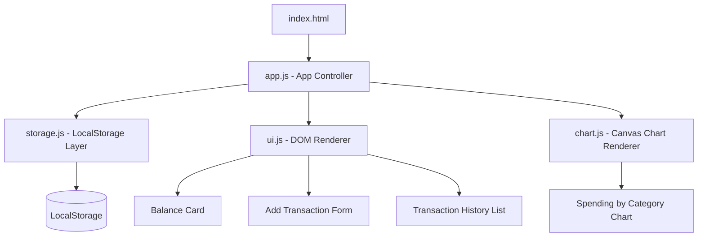
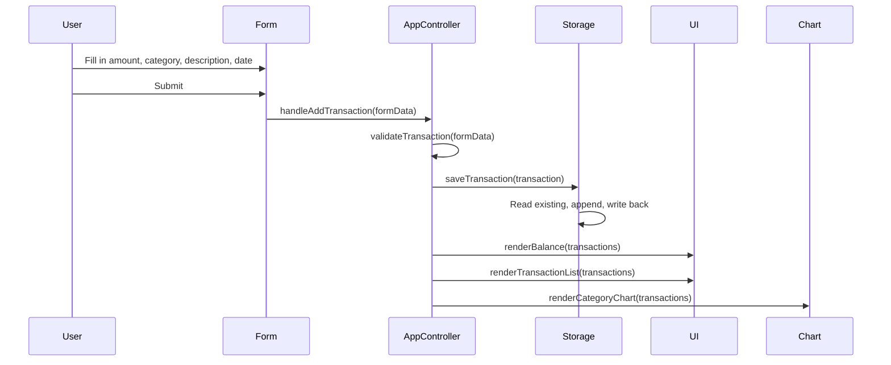
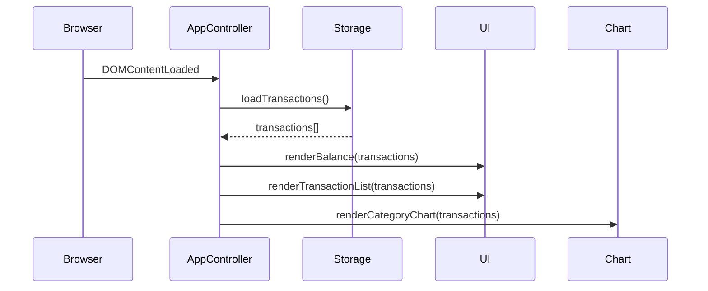
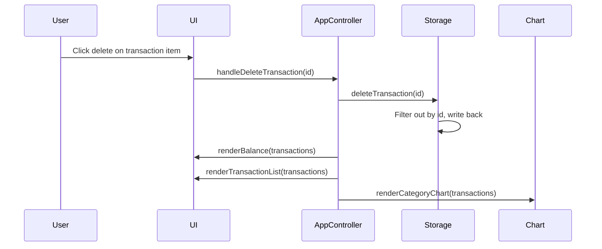

# Design Document: Expense & Budget Visualizer

## Overview

The Expense & Budget Visualizer is a mobile-friendly, single-page web application built with plain HTML, CSS, and Vanilla JavaScript. It allows users to track daily spending, view their running balance, browse transaction history, and visualize spending by category — all stored locally in the browser via the LocalStorage API with no backend required.

The app is designed to be lightweight, fast, and usable as either a standalone web page or a browser extension. The interface follows a clean, card-based layout optimized for small screens, with a chart rendered on an HTML5 `<canvas>` element.

---

## Architecture

The app is a single HTML file with embedded or linked CSS and JS modules. All state lives in LocalStorage and is loaded into memory on startup. The UI is re-rendered reactively whenever state changes.



### File Structure

```
expense-budget-visualizer/
├── index.html        # App shell, layout, and semantic structure
├── style.css         # Mobile-first responsive styles
└── app.js            # All JavaScript: state, storage, UI, chart
```

> All JS is kept in a single `app.js` to satisfy the no-framework, no-build-tool constraint. Internal functions are organized by concern.

---

## Sequence Diagrams

### Add Transaction Flow



### App Initialization Flow



### Delete Transaction Flow



---

## Components and Interfaces

### Component 1: App Controller (`app.js` — top-level)

**Purpose**: Bootstraps the app, wires event listeners, and orchestrates state updates across storage, UI, and chart.

**Interface**:
```javascript
function init()                                    // Entry point, called on DOMContentLoaded
function handleAddTransaction(formData)            // Validates and persists a new transaction
function handleDeleteTransaction(id)               // Removes a transaction by id
function handleSetBudget(amount)                   // Persists a monthly budget limit
function refreshUI(transactions, budget)           // Triggers full re-render of all UI sections
```

**Responsibilities**:
- Attach event listeners to form submit and delete buttons
- Coordinate between storage, UI renderer, and chart renderer
- Maintain in-memory `state` object for current session

---

### Component 2: Storage Module (functions in `app.js`)

**Purpose**: Abstracts all reads and writes to `localStorage`.

**Interface**:
```javascript
function loadTransactions()                        // Returns Transaction[] from localStorage
function saveTransaction(transaction)              // Appends one transaction and persists
function deleteTransaction(id)                     // Removes transaction by id and persists
function loadBudget()                              // Returns budget number or null
function saveBudget(amount)                        // Persists budget amount
```

**Responsibilities**:
- Serialize/deserialize JSON to/from `localStorage`
- Handle missing or corrupt data gracefully (return empty defaults)

---

### Component 3: UI Renderer (functions in `app.js`)

**Purpose**: Reads state and updates the DOM. Stateless — always renders from the data passed in.

**Interface**:
```javascript
function renderBalance(transactions, budget)       // Updates balance card and budget progress bar
function renderTransactionList(transactions)       // Rebuilds the transaction history list
function renderEmptyState()                        // Shows placeholder when no transactions exist
function formatCurrency(amount)                    // Returns locale-formatted currency string
function formatDate(isoString)                     // Returns human-readable date string
```

**Responsibilities**:
- Clear and rebuild DOM nodes for the transaction list
- Compute and display total income, total expenses, and net balance
- Show/hide empty state message

---

### Component 4: Chart Renderer (functions in `app.js`)

**Purpose**: Draws a donut/pie chart of spending by category on an HTML5 `<canvas>` element.

**Interface**:
```javascript
function renderCategoryChart(transactions)         // Redraws the full chart from transaction data
function aggregateByCategory(transactions)         // Returns { category: totalAmount } map
function drawDonutSegment(ctx, x, y, r, start, end, color)  // Draws one arc segment
function drawLegend(ctx, categories, colors)       // Draws color-coded legend below chart
```

**Responsibilities**:
- Aggregate expense transactions by category
- Map categories to a fixed color palette
- Draw chart using Canvas 2D API (no external chart library)
- Render a legend with category names and amounts

---

## Data Models

### Transaction

```javascript
/**
 * @typedef {Object} Transaction
 * @property {string} id          - UUID v4, generated client-side
 * @property {'income'|'expense'} type - Transaction type
 * @property {number} amount      - Positive number, stored in base currency units
 * @property {string} category    - One of the predefined CATEGORIES list
 * @property {string} description - Free-text label (max 100 chars)
 * @property {string} date        - ISO 8601 date string (YYYY-MM-DD)
 * @property {number} createdAt   - Unix timestamp (Date.now())
 */
```

**Validation Rules**:
- `amount` must be a finite positive number greater than 0
- `type` must be exactly `'income'` or `'expense'`
- `category` must be one of the values in `CATEGORIES`
- `description` must be a non-empty string, max 100 characters
- `date` must be a valid ISO date string

---

### AppState (in-memory only)

```javascript
/**
 * @typedef {Object} AppState
 * @property {Transaction[]} transactions - All loaded transactions
 * @property {number|null} budget         - Monthly expense budget, or null if unset
 */
```

---

### LocalStorage Schema

| Key | Value |
|-----|-------|
| `ebv_transactions` | JSON array of `Transaction` objects |
| `ebv_budget` | JSON number representing monthly budget |

---

### Predefined Categories

```javascript
const CATEGORIES = [
  'Food & Drink',
  'Transport',
  'Shopping',
  'Entertainment',
  'Health',
  'Housing',
  'Utilities',
  'Income',
  'Other'
];
```

---

## Algorithmic Pseudocode

### Main Initialization Algorithm

```pascal
ALGORITHM init()
INPUT: none
OUTPUT: none (side effects: DOM rendered, event listeners attached)

BEGIN
  transactions ← loadTransactions()
  budget ← loadBudget()
  
  ATTACH event listener: form.submit → handleAddTransaction
  ATTACH event listener: budgetInput.change → handleSetBudget
  ATTACH event listener: transactionList.click → handleDeleteTransaction (delegated)
  
  refreshUI(transactions, budget)
END
```

**Preconditions**: DOM is fully loaded (`DOMContentLoaded` has fired)
**Postconditions**: All UI sections are populated; event listeners are active

---

### Add Transaction Algorithm

```pascal
ALGORITHM handleAddTransaction(formData)
INPUT: formData { amount, type, category, description, date }
OUTPUT: none (side effects: storage updated, UI refreshed)

BEGIN
  IF NOT validateTransaction(formData) THEN
    DISPLAY validation error message
    RETURN
  END IF
  
  transaction ← {
    id: generateUUID(),
    type: formData.type,
    amount: parseFloat(formData.amount),
    category: formData.category,
    description: formData.description.trim(),
    date: formData.date,
    createdAt: Date.now()
  }
  
  saveTransaction(transaction)
  
  transactions ← loadTransactions()
  budget ← loadBudget()
  
  refreshUI(transactions, budget)
  resetForm()
END
```

**Preconditions**: `formData` is a plain object from the form submission event
**Postconditions**: New transaction is persisted; UI reflects updated state; form is cleared

---

### Balance Calculation Algorithm

```pascal
ALGORITHM computeBalance(transactions)
INPUT: transactions[] of type Transaction
OUTPUT: { totalIncome, totalExpenses, balance }

BEGIN
  totalIncome ← 0
  totalExpenses ← 0
  
  FOR each t IN transactions DO
    IF t.type = 'income' THEN
      totalIncome ← totalIncome + t.amount
    ELSE IF t.type = 'expense' THEN
      totalExpenses ← totalExpenses + t.amount
    END IF
  END FOR
  
  balance ← totalIncome - totalExpenses
  
  RETURN { totalIncome, totalExpenses, balance }
END
```

**Preconditions**: `transactions` is a valid array (may be empty)
**Postconditions**: Returns accurate totals; empty array returns all zeros
**Loop Invariant**: At each iteration, `totalIncome` and `totalExpenses` reflect the correct sum of all previously visited transactions

---

### Category Aggregation Algorithm

```pascal
ALGORITHM aggregateByCategory(transactions)
INPUT: transactions[] of type Transaction
OUTPUT: categoryMap { [category: string]: number }

BEGIN
  categoryMap ← {}
  
  FOR each t IN transactions DO
    IF t.type = 'expense' THEN
      IF categoryMap[t.category] EXISTS THEN
        categoryMap[t.category] ← categoryMap[t.category] + t.amount
      ELSE
        categoryMap[t.category] ← t.amount
      END IF
    END IF
  END FOR
  
  RETURN categoryMap
END
```

**Preconditions**: `transactions` is a valid array
**Postconditions**: Only expense transactions are included; each category key maps to the sum of its expenses
**Loop Invariant**: `categoryMap` always contains the correct cumulative totals for all previously visited expense transactions

---

### Donut Chart Drawing Algorithm

```pascal
ALGORITHM renderCategoryChart(transactions)
INPUT: transactions[] of type Transaction
OUTPUT: none (side effects: canvas redrawn)

BEGIN
  ctx ← canvas.getContext('2d')
  ctx.clearRect(0, 0, canvas.width, canvas.height)
  
  categoryMap ← aggregateByCategory(transactions)
  categories ← keys of categoryMap
  
  IF categories is empty THEN
    drawEmptyChartPlaceholder(ctx)
    RETURN
  END IF
  
  total ← sum of all values in categoryMap
  centerX ← canvas.width / 2
  centerY ← canvas.height / 2
  outerRadius ← min(centerX, centerY) * 0.8
  innerRadius ← outerRadius * 0.55   // donut hole
  
  currentAngle ← -π/2   // start at top
  
  FOR each category IN categories DO
    sliceAngle ← (categoryMap[category] / total) * 2π
    color ← COLOR_PALETTE[index mod COLOR_PALETTE.length]
    
    drawDonutSegment(ctx, centerX, centerY, outerRadius, innerRadius,
                     currentAngle, currentAngle + sliceAngle, color)
    
    currentAngle ← currentAngle + sliceAngle
  END FOR
  
  drawLegend(ctx, categoryMap, COLOR_PALETTE)
END
```

**Preconditions**: Canvas element exists in DOM; `transactions` is a valid array
**Postconditions**: Canvas displays a proportional donut chart; empty state shown if no expenses
**Loop Invariant**: `currentAngle` always equals the sum of all previously drawn slice angles plus the initial offset

---

### Validation Algorithm

```pascal
ALGORITHM validateTransaction(formData)
INPUT: formData { amount, type, category, description, date }
OUTPUT: isValid (boolean)

BEGIN
  amount ← parseFloat(formData.amount)
  
  IF isNaN(amount) OR amount <= 0 THEN
    RETURN false
  END IF
  
  IF formData.type NOT IN ['income', 'expense'] THEN
    RETURN false
  END IF
  
  IF formData.category NOT IN CATEGORIES THEN
    RETURN false
  END IF
  
  IF formData.description is empty OR length > 100 THEN
    RETURN false
  END IF
  
  IF formData.date is not a valid ISO date THEN
    RETURN false
  END IF
  
  RETURN true
END
```

**Preconditions**: `formData` is defined and is a plain object
**Postconditions**: Returns `true` only when all fields pass all rules; no mutations to `formData`

---

## Key Functions with Formal Specifications

### `generateUUID()`

```javascript
function generateUUID(): string
```

**Preconditions**: `crypto.randomUUID` is available (all modern browsers)
**Postconditions**: Returns a valid UUID v4 string; each call returns a unique value

---

### `loadTransactions()`

```javascript
function loadTransactions(): Transaction[]
```

**Preconditions**: `localStorage` is accessible
**Postconditions**: Returns a valid array (empty if key missing or data corrupt); never throws

---

### `saveTransaction(transaction)`

```javascript
function saveTransaction(transaction: Transaction): void
```

**Preconditions**: `transaction` is a valid `Transaction` object; `localStorage` is accessible
**Postconditions**: `transaction` is appended to the stored array; existing transactions are unchanged

---

### `deleteTransaction(id)`

```javascript
function deleteTransaction(id: string): void
```

**Preconditions**: `id` is a non-empty string; `localStorage` is accessible
**Postconditions**: Transaction with matching `id` is removed; if no match, storage is unchanged

---

### `renderBalance(transactions, budget)`

```javascript
function renderBalance(transactions: Transaction[], budget: number | null): void
```

**Preconditions**: DOM balance card elements exist; `transactions` is a valid array
**Postconditions**: Balance card shows correct income, expense, and net balance values; budget progress bar updated if `budget` is non-null

---

### `renderTransactionList(transactions)`

```javascript
function renderTransactionList(transactions: Transaction[]): void
```

**Preconditions**: DOM list container element exists
**Postconditions**: List contains exactly one item per transaction, sorted by `date` descending; empty state shown if array is empty

---

## Example Usage

```javascript
// Initialize app on page load
document.addEventListener('DOMContentLoaded', init);

// Adding a transaction programmatically (mirrors form submission)
handleAddTransaction({
  amount: '45.00',
  type: 'expense',
  category: 'Food & Drink',
  description: 'Lunch at cafe',
  date: '2024-01-15'
});

// Reading current balance
const transactions = loadTransactions();
const { totalIncome, totalExpenses, balance } = computeBalance(transactions);
console.log(`Balance: ${formatCurrency(balance)}`);

// Checking stored data directly
const raw = localStorage.getItem('ebv_transactions');
const parsed = JSON.parse(raw); // Transaction[]
```

---

## Correctness Properties

*A property is a characteristic or behavior that should hold true across all valid executions of a system — essentially, a formal statement about what the system should do.*

### Property 1: Balance Identity

*For any* array of transactions, the net balance always equals the sum of all income amounts minus the sum of all expense amounts.

**Validates: Requirements 3.1, 3.3**

### Property 2: Transaction Addition Round-Trip

*For any* valid transaction object, after saving it to LocalStorage and loading transactions back, the loaded array contains a transaction with the same id, amount, category, and description.

**Validates: Requirements 1.7, 10.1, 10.2**

### Property 3: Delete Removes Exactly One Item

*For any* transaction list and any id present in that list, deleting by that id produces a list exactly one item shorter that no longer contains the deleted transaction.

**Validates: Requirements 2.3, 10.3**

### Property 4: Delete Does Not Affect Other Transactions

*For any* transaction list, deleting a transaction by id leaves all other transactions unchanged.

**Validates: Requirements 10.3, 10.4**

### Property 5: Chart Totals Equal Expense Sum

*For any* array of transactions, the sum of all values in the category map produced by `aggregateByCategory` equals the sum of amounts of all expense-type transactions.

**Validates: Requirements 4.2, 4.3**

### Property 6: Validator Rejects Non-Positive Amounts

*For any* form data where the amount is zero, negative, or non-numeric, `validateTransaction` returns false.

**Validates: Requirements 1.5, 9.1**

---

## Error Handling

### Scenario 1: Corrupt LocalStorage Data

**Condition**: `JSON.parse` throws when reading `ebv_transactions`
**Response**: Catch the error, log a warning, return an empty array
**Recovery**: App starts fresh; user can add new transactions normally

### Scenario 2: Invalid Form Submission

**Condition**: User submits form with missing or invalid fields
**Response**: `validateTransaction` returns `false`; inline error message shown near the offending field
**Recovery**: Form remains populated so user can correct and resubmit

### Scenario 3: LocalStorage Quota Exceeded

**Condition**: `localStorage.setItem` throws `QuotaExceededError`
**Response**: Catch the error; show a toast notification: "Storage full — please delete old transactions"
**Recovery**: User deletes transactions to free space; no data loss of existing records

### Scenario 4: Canvas Not Supported

**Condition**: Browser does not support `<canvas>` (very rare in modern browsers)
**Response**: Show a fallback `<noscript>`-style message inside the canvas container
**Recovery**: All other features (balance, history) remain fully functional

---

## Testing Strategy

### Unit Testing Approach

Since no test framework is required (NFR-1), correctness is validated via the inline assertions in the Correctness Properties section above, plus manual browser console testing.

Key functions to verify manually:
- `computeBalance` with mixed income/expense arrays
- `aggregateByCategory` with duplicate categories
- `validateTransaction` with boundary values (0, negative, empty string, 101-char description)
- `loadTransactions` when localStorage key is absent or contains invalid JSON

### Property-Based Testing Approach

If a test framework is added later, these properties are suitable for property-based testing:

**Property Test Library**: fast-check (JavaScript)

- For any array of transactions, `computeBalance(transactions).balance` always equals the sum of income amounts minus the sum of expense amounts
- For any valid transaction `t`, `loadTransactions()` after `saveTransaction(t)` always contains `t`
- For any `id`, `deleteTransaction(id)` never increases the length of stored transactions
- `aggregateByCategory` totals always equal the sum of all expense `amount` values

### Integration Testing Approach

Manual end-to-end flows to verify in browser:
1. Add 3 expenses and 1 income → verify balance card and chart update correctly
2. Delete a transaction → verify it disappears from list and chart recalculates
3. Refresh page → verify all data persists from LocalStorage
4. Set a budget → verify progress bar reflects current expense total vs budget

---

## Performance Considerations

- All DOM updates re-render only the affected sections (balance card, list, chart) — not the full page
- Transaction list uses `DocumentFragment` for batch DOM insertion to avoid layout thrashing
- Chart redraws are synchronous canvas operations; with typical transaction counts (<1000) this is imperceptible
- LocalStorage reads are synchronous; kept minimal (one read on init, one per mutation)

---

## Security Considerations

- All user input is sanitized before insertion into the DOM using `textContent` (not `innerHTML`) to prevent XSS
- No external network requests are made; all data stays client-side
- No sensitive financial account data is stored — only user-entered amounts and descriptions
- LocalStorage is origin-scoped by the browser; no cross-origin access is possible

---

## Dependencies

| Dependency | Version | Purpose |
|------------|---------|---------|
| None | — | No external libraries required |

All rendering (including charts) is implemented with native browser APIs: DOM, Canvas 2D, and LocalStorage.
